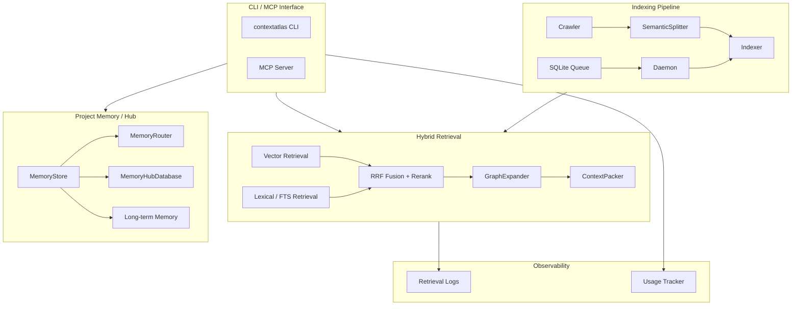

# ContextAtlas

<p align="center">
  <strong>Code retrieval, project memory, and context infrastructure for AI agents</strong>
</p>

<p align="center">
  <em>Hybrid Retrieval • Project Memory Hub • Retrieval Observability • Index Optimization</em>
</p>

<p align="center">
  <a href="./README.md">简体中文</a>
</p>

---

**ContextAtlas** is a context infrastructure toolkit for Harness Engineerings:

- Use **hybrid retrieval** (vector + lexical + rerank) to find the right code
- Use **project memory** and a **cross-project hub** to shorten repository understanding time
- Use **long-term memory** to preserve collaboration rules and user preferences that cannot be inferred reliably from code
- Use **async indexing** and **retrieval telemetry** to make the system observable and optimizable

## Contents

- [Overview](#overview)
  - [Architecture Design](#architecture-design)
  - [Core Concepts](#core-concepts)
    - [Hybrid Retrieval](#hybrid-retrieval)
    - [Project Memory](#project-memory)
    - [Long-term Memory](#long-term-memory)
    - [Cross-project Hub](#cross-project-hub)
  - [Architecture Overview](#architecture-overview)
  - [Project Structure](#project-structure)
- [Deployment and Usage](#deployment-and-usage)
  - [Quick Start](#quick-start)
  - [Use from Agent Skills](#use-from-agent-skills)
  - [Use as an MCP Server](#use-as-an-mcp-server)
- [Observability and Optimization](#observability-and-optimization)
- [Further Reading](#further-reading)
- [Development](#development)

---

## Overview

### Architecture Design

<p align="center">
  
</p>

### Core Concepts

#### Hybrid Retrieval

Retrieval pipeline: **vector recall → FTS lexical recall → RRF fusion → rerank → context expansion → token packing**

- **Semantic**: understands what the code is doing
- **Lexical / FTS**: precisely matches class names, function names, and constants
- **RRF Fusion**: merges multiple recall channels
- **Rerank**: refines candidate ordering
- **GraphExpander**: three-stage context expansion (neighbors / breadcrumbs / import resolution)
- **ContextPacker**: keeps the highest-value context within the token budget

#### Project Memory

The primary store is `~/.contextatlas/memory-hub.db` (SQLite), which contains three categories of information:

| Type | Content |
|------|---------|
| **Feature Memory** | Module responsibilities, files, exports, dependencies, and data flow |
| **Decision Record** | Architecture decisions, alternatives, rationale, and impact |
| **Project Profile** | Tech stack, structure, conventions, and hot paths |

Memory routing uses progressive loading: `Catalog (routing index) → Global (shared conventions) → Feature (loaded on demand)`.

#### Long-term Memory

Stores only information that cannot be derived reliably from the repository: user preferences, collaboration rules, project-level non-code state, and external reference links. Supports expiry, verification, and stale cleanup.

#### Cross-project Hub

Share and reuse module knowledge across repositories:

- Project registration and unified identity management
- Cross-project feature memory search
- Relationship graph (`depends_on` / `extends` / `references` / `implements`)
- Recursive dependency chain analysis

### Architecture Overview



### Project Structure

```text
src/
├── api/                  # Embedding / rerank / Unicode safety
├── chunking/             # Tree-sitter semantic chunking
├── db/                   # SQLite + FTS
├── indexing/             # Index queue and daemon
├── mcp/                  # MCP server and tools
├── memory/               # Project memory / hub / long-term memory
├── monitoring/           # Retrieval log analysis
├── search/               # SearchService / GraphExpander / ContextPacker
├── storage/              # Snapshot layout and atomic switch
├── usage/                # Usage tracking and index optimization
└── utils/                # Logging and shared utilities
```

## Deployment and Usage

You can use ContextAtlas in two complementary ways:

1. **As a local CLI + skill backend** for agents that want search, indexing, and memory workflows inside prompts or skills
2. **As an MCP server** for clients that consume tools over the Model Context Protocol

For the full deployment guide, including five deployment scenarios, MCP integration, and prompt templates, see the [Deployment Guide](./docs/DEPLOYMENT.md).

### Quick Start

```bash
npm install -g @codefromkarl/context-atlas
contextatlas init
# Edit ~/.contextatlas/.env and add your API keys
contextatlas index /path/to/repo
contextatlas daemon start
cw search --information-request "How is the authentication flow implemented?"
```

### Use from Agent Skills

ContextAtlas does not have to be exposed only through MCP. It can also be used as the backend for agent skills, internal workflows, or shell-based toolchains.

Typical skill-driven usage looks like this:

1. **Initialize once** with `contextatlas init`
2. **Index the target repository** with `contextatlas index /path/to/repo`
3. **Keep indexing warm** with `contextatlas daemon start` for incremental updates
4. **Call the CLI from a skill or workflow** when the agent needs retrieval or memory operations

Example commands a skill can invoke directly:

```bash
# Semantic / hybrid retrieval
cw search --information-request "Where is the payment retry policy implemented?"

# Project memory and hub workflows
contextatlas hub:find --query "authentication module"

# Observability and health checks
contextatlas health:check
contextatlas monitor:retrieval --days 7
```

This pattern is useful when you want:

- tighter integration with custom agent skills or orchestration layers
- prompt-controlled workflows instead of MCP tool registration
- a simple GitHub-friendly setup that works in local terminals, CI, or agent wrappers

### Use as an MCP Server

Start the MCP server:

```bash
contextatlas mcp
```

Claude Desktop configuration example (`claude_desktop_config.json`):

```json
{
  "mcpServers": {
    "contextatlas": {
      "command": "contextatlas",
      "args": ["mcp"]
    }
  }
}
```

> For detailed MCP integration, Cursor/Windsurf setup, and companion system prompt templates, see [Deployment Guide → Companion Prompts](./docs/DEPLOYMENT.md#配套提示词).

## Observability and Optimization

`codebase-retrieval` includes telemetry for stage timings and retrieval statistics. The reporting commands help you spot:

- whether cold start is too heavy
- whether reranking has become the main cost center
- whether packing budgets are frequently exhausted
- whether latency or quality has regressed

```bash
contextatlas monitor:retrieval --days 7
contextatlas usage:index-report --days 7
contextatlas health:check              # index health (queue / snapshots / daemon)
contextatlas alert:eval                # threshold-based alert evaluation
```

## Further Reading

| Document | Description |
|----------|-------------|
| [Deployment Guide](./docs/DEPLOYMENT.md) | Five deployment scenarios, MCP integration, companion prompts, and operations |
| [CLI Command Reference](./docs/CLI.md) | All CLI commands for retrieval, indexing, memory, hub, and monitoring |
| [MCP Tool Reference](./docs/MCP.md) | Overview of 15 MCP tools, configuration, and call examples |
| [Project Memory Deep Dive](./PROJECT_MEMORY.md) | Feature Memory, Decision Record, and catalog routing |
| [Product Roadmap](./PRODUCT_EVOLUTION_ROADMAP.md) | Planned capabilities and evolution direction |

## Development

```bash
pnpm build
pnpm dev
node dist/index.js
```

## License

MIT
