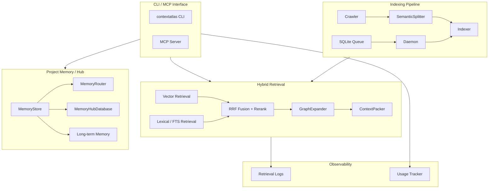

# ContextAtlas

<p align="center">
  <strong>为 AI Agent 设计的代码检索、项目记忆与上下文基础设施</strong>
</p>

<p align="center">
  <em>Hybrid Retrieval • Project Memory Hub • Retrieval Observability • Index Optimization</em>
</p>

---

**ContextAtlas** 是一套面向 AI 编码助手的上下文基础设施：

- 用**混合检索**（向量 + 词法 + Rerank）找到正确代码
- 用**项目记忆**和**跨项目 Hub** 缩短 AI 理解代码的路径
- 用**长期记忆**保存无法从代码稳定推导的协作规则和用户偏好
- 用**异步索引**和**检索遥测**让系统可观测、可优化

## 总体思路

### 架构设计

<p align="center">
  
</p>

### 核心概念

#### 混合检索

检索链路：**向量召回 → FTS 词法召回 → RRF 融合 → Rerank 精排 → 上下文扩展 → Token 打包**

- **Semantic**：理解"这段代码在做什么"
- **Lexical / FTS**：精确匹配类名、函数名、常量
- **RRF Fusion**：合并多路召回
- **Rerank**：对候选结果精排
- **GraphExpander**：三阶段上下文扩展（邻居 / 面包屑 / 导入解析）
- **ContextPacker**：在 token 预算内保留最有价值的上下文

#### 项目记忆

主存储是 `~/.contextatlas/memory-hub.db`（SQLite），包含三类信息：

| 类型 | 内容 |
|------|------|
| **Feature Memory** | 模块职责、文件、导出、依赖、数据流 |
| **Decision Record** | 架构决策、替代方案、理由和影响 |
| **Project Profile** | 技术栈、结构、约定、热路径 |

记忆路由采用渐进式加载：`Catalog（路由索引）→ Global（全局约定）→ Feature（按需加载）`。

#### 长期记忆

只保存**无法从仓库稳定推导**的信息：用户偏好、协作规则、项目级非代码状态、外部参考链接。支持过期、核验和 stale 清理。

#### 跨项目 Hub

在多个项目间共享和复用模块知识：

- 项目注册与统一身份管理
- 跨项目 Feature Memory 搜索
- 关系图谱（depends_on / extends / references / implements）
- 递归依赖链分析

### 架构概览



### 项目结构

```text
src/
├── api/                  # Embedding / Rerank / Unicode 安全
├── chunking/             # Tree-sitter 语义分片
├── db/                   # SQLite + FTS
├── indexing/             # 索引队列与 daemon
├── mcp/                  # MCP 服务端与工具
├── memory/               # 项目记忆 / Hub / 长期记忆
├── monitoring/           # Retrieval 日志分析
├── search/               # SearchService / GraphExpander / ContextPacker
├── storage/              # 快照布局与原子切换
├── usage/                # 使用追踪与索引优化
└── utils/                # 日志与通用工具
```

## 部署与使用

### 安装

```bash
npm install -g @codefromkarl/context-atlas
```

### 初始化

```bash
contextatlas init
```

生成配置文件 `~/.contextatlas/.env`，填入 Embedding 和 Rerank API 密钥：

```bash
EMBEDDINGS_API_KEY=your-api-key
EMBEDDINGS_BASE_URL=https://api.siliconflow.cn/v1/embeddings
EMBEDDINGS_MODEL=BAAI/bge-m3
RERANK_API_KEY=your-api-key
RERANK_BASE_URL=https://api.siliconflow.cn/v1/rerank
RERANK_MODEL=BAAI/bge-reranker-v2-m3
```

### 索引代码库

```bash
contextatlas index /path/to/repo
contextatlas daemon start
```

### 搜索代码

```bash
cw search --information-request "用户认证流程是如何实现的？"
```

### 启动 MCP 服务器

```bash
contextatlas mcp
```

## 观测与优化

`codebase-retrieval` 内建遥测，记录各阶段耗时和检索统计。通过报告命令可发现：

- 冷启动是否过重
- Rerank 是否成为主要成本中心
- 打包预算是否经常耗尽
- 是否存在延迟或质量回归

```bash
contextatlas monitor:retrieval --days 7
contextatlas usage:index-report --days 7
```

## 进一步阅读

| 文档 | 内容 |
|------|------|
| [CLI 命令参考](./docs/CLI.md) | 所有 CLI 命令：检索、索引、记忆、Hub、监控 |
| [MCP 工具参考](./docs/MCP.md) | 15 个 MCP 工具总览、配置、调用示例 |
| [项目记忆详解](./PROJECT_MEMORY.md) | Feature Memory、Decision Record、Catalog 路由 |
| [产品路线图](./PRODUCT_EVOLUTION_ROADMAP.md) | 功能规划与演进方向 |

## 开发

```bash
pnpm build
pnpm dev
node dist/index.js
```

## License

MIT
