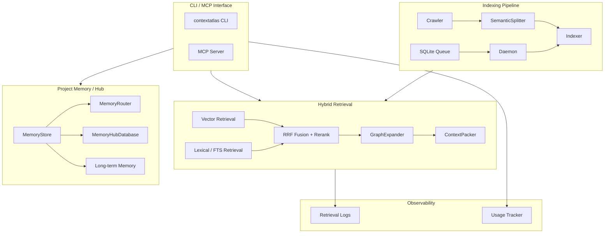

# ContextAtlas

<p align="center">
  <strong>ContextAtlas：为 AI Agent 设计的代码检索、项目记忆与上下文基础设施</strong>
</p>

<p align="center">
  <em>Hybrid Retrieval • Project Memory Hub • Retrieval Observability • Index Optimization</em>
</p>

---

**ContextAtlas** 不只是语义代码检索器，而是一套面向 AI 编码助手的上下文基础设施：

- 用更完整的混合检索找到正确代码
- 用项目记忆和跨项目 Hub 进一步缩短理解路径
- 用长期记忆保存无法从代码稳定推导的信息
- 用异步索引、监控和使用追踪把检索链路做成更可观测、可优化的系统

## 核心能力

| 模块 | 能力 |
|------|------|
| 混合检索 | 向量召回 + FTS 词法召回 + RRF 融合 + rerank 精排 |
| AST 语义分片 | Tree-sitter 分片，支持 TypeScript/JavaScript/Python/Go/Java/Rust |
| 上下文扩展 | 邻居扩展、breadcrumb 补全、跨文件 import 解析 |
| 项目记忆 | Feature Memory、Decision Record、Project Profile、Catalog 路由 |
| 长期记忆 | 保存用户偏好、协作规则、项目状态、外部参考 |
| 跨项目 Hub | 项目注册、跨项目搜索、关系图谱、依赖链分析 |
| 索引可靠性 | SQLite 队列、daemon 消费、快照写入、原子切换 |
| 观测与优化 | retrieval telemetry、usage tracker、索引优化报告 |
| MCP 原生集成 | 22 个 MCP 工具，覆盖检索、记忆、Hub、自动记录与维护 |

## 检索与记忆模型

### 1. 混合检索

- **Semantic Retrieval**：理解“这段代码在做什么”
- **Lexical / FTS Retrieval**：精确匹配类名、函数名、常量等术语
- **RRF Fusion**：合并多路召回结果
- **Rerank**：对候选结果精排
- **Context Packing**：在 token 预算内保留最有价值的上下文

### 2. 项目记忆

项目记忆的主存储是单一 SQLite 数据库：

```text
~/.contextatlas/memory-hub.db
```

它包含三类稳定信息：

- **Feature Memory**：模块职责、文件、导出、依赖、数据流
- **Decision Record**：架构决策、替代方案、理由和影响
- **Project Profile**：技术栈、结构、约定、热路径

记忆路由采用渐进式加载：

```text
请求 -> MemoryRouter
  -> Catalog（路由索引）
  -> Global（profile / conventions / cross-cutting）
  -> Feature（按 query/path/scope 需加载）
```

`find_memory` 适合先做模块定位，`load_module_memory` 适合更大规模、更精细的按需加载。

### 3. 长期记忆

长期记忆只保存**无法从仓库稳定推导**的信息，例如：

- 用户偏好与协作方式
- 项目级非代码状态
- 外部文档、看板、面板链接
- 会过期或需要重新核验的参考事实

支持的类型：

- `user`
- `feedback`
- `project-state`
- `reference`

支持 `project` 和 `global-user` 两类作用域，并带过期、核验时间和 stale 清理能力。

### 4. 跨项目 Hub

跨项目记忆中心同样基于 `~/.contextatlas/memory-hub.db`，支持：

- 项目注册与统一身份管理
- 跨项目 Feature Memory 搜索
- `depends_on / extends / references / implements` 关系图谱
- 递归依赖链分析
- 分类统计与共享模式复用

## 索引与可靠性

### 异步索引队列

查询与索引解耦：

- 查询发现索引缺失时，只负责入队
- 守护进程后台消费 SQLite 持久化任务队列
- 支持队列去重与复用，避免重复全量索引

常用命令：

```bash
contextatlas index
contextatlas index /path/to/repo
contextatlas index --force

contextatlas daemon start
contextatlas daemon once
```

### 快照存储与原子切换

索引采用快照目录写入，查询只读当前快照：

```text
~/.contextatlas/<projectId>/
├── current
└── snapshots/
    ├── snap-...
    └── snap-...
```

- 索引先写 staging 快照
- 健康检查通过后原子切换 `current`
- 查询不会读到半更新状态
- 自动清理旧快照

### 输入与 payload 安全

- **Unicode 安全清洗**：清理孤立代理项，避免上游 Embedding API 直接 400
- **Payload Too Large 定位与跳过**：单个问题文件不会拖垮整轮索引
- **旧 `.project-memory/` 自动导入**：兼容历史 JSON 记忆格式，但不再作为主存储

## 观测与优化闭环

### Retrieval 监控

`codebase-retrieval` 内建 telemetry，完成日志会记录：

- `requestId`
- 阶段耗时：`init / retrieve / rerank / expand / pack`
- 细分耗时：`retrieveVector / retrieveLexical / retrieveFuse`
- 检索统计：`lexicalStrategy / vectorCount / lexicalCount / fusedCount`
- 结果统计：`seedCount / expandedCount / totalChars / budgetExhausted`
- rerank token 使用量

报告命令：

```bash
contextatlas monitor:retrieval
contextatlas monitor:retrieval --json
contextatlas monitor:retrieval --days 7
contextatlas monitor:retrieval --dir ~/.contextatlas/logs --days 7
contextatlas monitor:retrieval --days 7 --project-id <projectId>
contextatlas monitor:retrieval --dir ~/.contextatlas/logs --request-id <requestId> --json
```

这份报告可直接发现：

- 冷启动是否过重
- `chunks_fts` 是否经常降级到 `files_fts`
- rerank 是否成为主要成本中心
- 零种子查询是否上升
- 打包预算是否经常耗尽
- 是否存在时序上的延迟或质量回归

### 使用追踪与索引优化

系统会持续记录两类事件：

- **工具使用事件**：工具名、项目、耗时、索引状态、请求来源
- **索引事件**：入队、复用、执行成功/失败、全量/增量分布

存储位置：

```text
~/.contextatlas/usage-tracker.db
```

报告命令：

```bash
contextatlas usage:index-report
contextatlas usage:index-report --json
contextatlas usage:index-report --days 7
contextatlas usage:index-report --days 7 --project-id <projectId>
```

报告会给出可执行建议，例如：

- 先为热点项目预建索引
- 持续运行 `contextatlas daemon start`
- 降低全量索引比例
- 优先修复索引执行失败

## 快速开始

### 环境要求

- Node.js >= 20
- pnpm 或 npm

### 安装

```bash
npm install -g @codefromkarl/context-atlas
# 或
pnpm add -g @codefromkarl/context-atlas
```

### 初始化

```bash
contextatlas init
# 简写
cw init
```

这会生成配置文件：

```text
~/.contextatlas/.env
```

最小配置示例：

```bash
# Embedding API
EMBEDDINGS_API_KEY=your-api-key
EMBEDDINGS_BASE_URL=https://api.siliconflow.cn/v1/embeddings
EMBEDDINGS_MODEL=BAAI/bge-m3
EMBEDDINGS_MAX_CONCURRENCY=10
EMBEDDINGS_BATCH_SIZE=20
EMBEDDINGS_GLOBAL_MIN_INTERVAL_MS=200
EMBEDDINGS_DIMENSIONS=1024

# Rerank API
RERANK_API_KEY=your-api-key
RERANK_BASE_URL=https://api.siliconflow.cn/v1/rerank
RERANK_MODEL=BAAI/bge-reranker-v2-m3
RERANK_TOP_N=20

# 可选
# IGNORE_PATTERNS=.venv,node_modules
# CONTEXTATLAS_BASE_DIR=~/.contextatlas
# CONTEXTATLAS_USAGE_DB_PATH=~/.contextatlas/usage-tracker.db
```

### 本地检索

```bash
cw search --information-request "用户认证流程是如何实现的？"

cw search \
  --repo-path /path/to/repo \
  --information-request "数据库连接逻辑" \
  --technical-terms "DatabasePool,Connection"
```

### 启动 MCP 服务器

```bash
contextatlas mcp
```

## MCP 工具总览（22 个）

### 代码检索

- `codebase-retrieval`

### 项目记忆

- `find_memory`
- `record_memory`
- `delete_memory`
- `record_decision`
- `get_project_profile`
- `maintain_memory_catalog`
- `load_module_memory`
- `list_memory_catalog`

### 长期记忆

- `record_long_term_memory`
- `manage_long_term_memory` (find / list / prune / delete)

### 跨项目 Hub

- `query_shared_memories`
- `link_memories`
- `get_dependency_chain`
- `manage_projects` (register / list / stats)

### 自动记录

- `session_end`
- `suggest_memory`

推荐使用顺序：

1. 先 `find_memory` 定位已有模块知识
2. 再 `codebase-retrieval` 看具体实现
3. 完成后用 `record_memory` / `record_decision` / `session_end` 回写稳定知识
4. 遇到跨项目模式复用时，再用 `query_shared_memories`

## CLI 常用命令

### 检索与索引

```bash
contextatlas index [path]
contextatlas daemon start
contextatlas daemon once
cw search --information-request "..."
contextatlas monitor:retrieval --days 7
contextatlas usage:index-report --days 7
```

### 项目记忆

```bash
contextatlas memory:find "auth"
contextatlas memory:record "Auth Module" --desc "用户认证" --dir "src/auth"
contextatlas memory:list
contextatlas memory:delete "Auth Module"
contextatlas memory:rebuild-catalog
contextatlas memory:check-consistency
contextatlas memory:prune-long-term --include-stale
```

### 架构决策与项目档案

```bash
contextatlas decision:record "2026-04-02-memory-routing" \
  --title "引入渐进式记忆路由" \
  --context "需要控制代理加载的上下文大小" \
  --decision "使用 catalog -> global -> feature 三层加载" \
  --rationale "先路由再按需加载，减少 token 开销"

contextatlas decision:list
contextatlas profile:show
```

### 跨项目 Hub

```bash
contextatlas hub:register-project /path/to/project --name "My Project"
contextatlas hub:list-projects
contextatlas hub:save-memory <projectId> "SearchService" --desc "混合搜索核心" --dir "src/search"
contextatlas hub:search --category search
contextatlas hub:fts "向量 搜索"
contextatlas hub:link <fromProject> <fromModule> <toProject> <toModule> depends_on
contextatlas hub:deps <projectId> <moduleName>
contextatlas hub:stats
contextatlas hub:repair-project-identities --dry-run
```

## MCP 集成示例

### Claude Desktop

```json
{
  "mcpServers": {
    "contextatlas": {
      "command": "contextatlas",
      "args": ["mcp"]
    }
  }
}
```

### 典型调用

```json
{
  "repo_path": "/path/to/repo",
  "information_request": "Trace the execution flow of the login process",
  "technical_terms": ["AuthService", "login"]
}
```

## 架构概览



## 项目结构

```text
src/
├── api/                  # Embedding / Rerank / Unicode 安全处理
├── chunking/             # Tree-sitter 语义分片
├── db/                   # SQLite + FTS
├── indexing/             # 索引队列与 daemon
├── mcp/                  # MCP 服务端与工具定义
├── memory/               # Project Memory / Hub / Long-term Memory
├── monitoring/           # Retrieval 日志分析
├── search/               # SearchService / GraphExpander / ContextPacker
├── storage/              # 快照布局与原子切换
├── usage/                # 使用追踪与索引优化分析
└── utils/                # 日志与通用工具
```

## 相关文档

- [PRODUCT_EVOLUTION_ROADMAP.md](./PRODUCT_EVOLUTION_ROADMAP.md) — 产品演进路线图
- [PROJECT_MEMORY.md](./PROJECT_MEMORY.md) — 项目记忆层详细说明

## 开发命令

```bash
pnpm build
pnpm build:release
pnpm dev
node dist/index.js
```

## License

MIT
