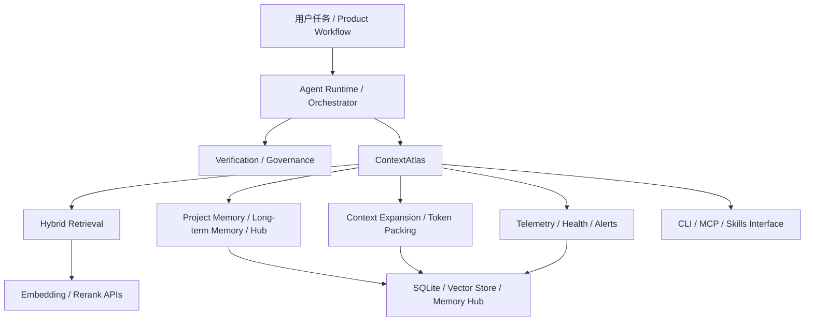

# ContextAtlas：Harness Engineering 的上下文基础设施层

## 为什么需要这份文档

README 介绍了 ContextAtlas 的功能、部署方式和使用入口，但对于一个更完整的 AI engineering / agent engineering 系统来说，仅知道它“能做检索、记忆和 MCP”还不够。

在实际工程中，开发者很容易把以下几类能力混在一起理解：

- agent 本体（模型 + 推理）
- orchestration / workflow 控制
- tools / MCP 接入
- retrieval / memory / context packing
- verification / governance
- observability / operations

这会导致一个常见问题：**项目功能知道了，但工程位置不清楚。**

本文的目的，是从 **harness engineering** 的视角解释 ContextAtlas 在整体 AI 工程流中的角色、边界和模块定位。

---

## 什么是 Harness Engineering

在 AI agent 系统中，**harness engineering** 可以理解为：

> 模型之外、用于约束、引导、支撑、验证和观测 agent 行为的一整套工程系统。

这个术语目前还没有完全统一的行业标准定义，但有几个共识值得借鉴。

### Martin Fowler / Thoughtworks 的视角

Birgitta Böckeler 在 Martin Fowler 站点的文章《Harness engineering for coding agent users》中，将 harness 看作 coding agent 之外的一整套“控制与调节系统”。这个视角强调两类机制：

- **Feedforward / Guides**：在 agent 行动前提供约束、规范和引导，提升第一次就做对的概率
- **Feedback / Sensors**：在 agent 行动后提供信号，让它能够自我纠偏或触发人工兜底

同时，这些机制又可以分为两类：

- **Computational**：LSP、lint、tests、脚本、结构分析等确定性工具
- **Inferential**：review agents、LLM judge、语义评审等推断型机制

在这个框架下，**context engineering 本身就是 harness engineering 的一部分**。也就是说，如何在正确时机把正确上下文交给 agent，不是附属能力，而是 agent 可控性的核心工程问题。

### Anthropic 的视角

Anthropic 在《Effective harnesses for long-running agents》中讨论的是更偏工程实现的问题：当 agent 的任务会跨越多个 context window、多个执行阶段时，如何让它持续推进，而不是在中途失忆、重复劳动或过早宣称完成。

这篇文章的关键思想包括：

- 区分 **initializer agent** 与后续的 **coding agent**
- 在第一轮执行中建立未来多个 session 都依赖的环境基础
- 使用 `init.sh`、progress file、git history、feature list 等可持续工件传递状态
- 强制 agent 按 feature 增量推进，而不是试图一次性完成整个任务
- 在每次 session 结束前，把代码恢复到可继续接手的 clean state
- 用显式的验证步骤，防止 agent 过早把功能标记为完成

这套思想的重点不是“prompt 怎么写”，而是：

> 长任务 agent 要想可持续工作，必须有一层独立于模型的工程结构来管理上下文连续性、任务状态、验证节奏和可恢复性。

---

## 从 Harness Engineering 看整体 AI 工程流

一个面向软件工程的 AI agent 系统，可以粗略拆成下面几层：

```text
用户任务 / 产品工作流
    ↓
Agent Runtime / Orchestrator
    ↓
Verification / Governance Layer
    ↓
Context & Memory Infrastructure Layer
    ↓
Tool / Protocol Exposure Layer
    ↓
Storage / Index / Telemetry Layer
    ↓
Model / Embedding / Rerank APIs
```

在这个分层里：

- **Agent Runtime / Orchestrator** 负责决策、分解任务、安排工具调用
- **Verification / Governance** 负责检查 agent 是否做对、是否越界、是否需要人工兜底
- **Context & Memory Infrastructure** 负责让 agent 在正确时机拿到正确上下文，并在多轮任务中保持持续理解
- **Tool / Protocol Exposure** 负责把能力通过 CLI、MCP、skills 等方式暴露出来
- **Storage / Index / Telemetry** 负责索引、快照、状态、观测和底层持久化

Harness engineering 的重点，不是只把模型接上工具，而是把这些层连接成一个可持续、可控、可诊断的系统。

---

## Anthropic《Effective harnesses for long-running agents》的设计思想

Anthropic 的文章讨论的是一个非常典型的问题：

> 当 agent 需要跨越多个 context window、多个执行阶段、甚至数小时以上持续推进任务时，仅靠单轮 prompt 和普通会话历史是不够的。

### 它试图解决什么问题

文中提到了几个典型失败模式：

1. agent 一上来试图“一次做完整个系统”，导致任务中途断裂
2. 新 session 无法快速知道前一个 session 做了什么
3. agent 看到已有进展后，错误地判断“任务已经完成”
4. agent 在没有真正验证的情况下，把 feature 标记为 done
5. 环境被改乱后，下一个 session 需要先花大量时间清理现场

### 它的核心设计

Anthropic 给出的设计不是让模型“更聪明”，而是让系统“更可持续”：

#### 1. Initializer Agent

第一轮 agent 不是直接开始做业务实现，而是先搭基础环境，例如：

- 建立 `init.sh`
- 生成 feature list
- 创建 progress file
- 初始化 git 历史

这个阶段的职责是：

> 把后续多个 session 共用的上下文工件准备好。

#### 2. Coding Agent 增量推进

后续 agent 不追求一步完成，而是：

- 每次只解决一小块功能
- 阅读 progress file 和 git history 获取当前状态
- 只在完成验证后把 feature 标记为完成
- 每次结束前把环境恢复到 clean state

#### 3. Context Continuity 依赖显式工件

长任务的连续性不是靠“模型记住了什么”，而是靠系统准备的工件：

- progress file
- feature list
- init script
- git commits

这些工件共同承担跨窗口状态传递。

#### 4. Verification 不是可选项

Anthropic 明确强调，agent 经常在没真正验证的情况下误判完成状态。因此 harness 必须设计成：

- 让验证路径显式存在
- 让“未验证完成”变得困难
- 让状态更新依赖验证结果，而不是依赖模型主观判断

### 这套设计的本质

可以把 Anthropic 这套方法概括为一句话：

> 长任务 agent 的可靠性，不来自单次推理能力，而来自一套能维持上下文连续性、任务分解、状态传递和验证节奏的 harness。

---

## ContextAtlas 在其中的定位

如果用上面的框架来映射，ContextAtlas 的核心定位不是 agent runtime，也不是 task orchestrator，而是：

> **面向 AI agent 的上下文基础设施层（Context Infrastructure Layer）**。

更具体地说，它承担三类底座职责：

- **Retrieval Substrate**：把代码库变成可检索、可扩展、可打包的语义对象
- **Memory Substrate**：把项目知识、决策和长期记忆变成可持续复用的上下文资产
- **Observability Substrate**：让索引、检索和上下文系统本身可观测、可诊断、可优化

### 它是什么

ContextAtlas 提供的是：

- hybrid retrieval
- graph-based context expansion
- token-aware context packing
- project memory / long-term memory
- cross-project knowledge hub
- retrieval telemetry / index health / alerting
- 通过 CLI、MCP、skills 暴露统一能力接口

换句话说，ContextAtlas 处理的是：

> 当上层 agent 要工作时，如何获得高价值、低噪声、可持续的代码上下文和项目知识。

### 它不是什么

为了避免工程定位混淆，也必须明确 ContextAtlas 不负责的部分：

- 它不是 agent 本体
- 它不是 planner / scheduler / workflow orchestrator
- 它不是完整的 verification harness
- 它不是业务工具执行器
- 它不是端到端任务控制平面

因此，ContextAtlas 不直接决定“任务应该怎么推进”，而是决定：

> **当任务推进时，上层系统能否稳定获得足够好的上下文基础。**

---

## 从 Anthropic 的 harness 思路看，ContextAtlas 补的是哪一层

Anthropic 的长任务 harness 强调跨 session 的持续推进能力，而这种能力并不只依赖 progress file 和 git history。对真实软件工程任务来说，还需要更强的上下文基础设施来支持以下问题：

### 1. agent 如何快速找到正确代码

仅仅“有代码仓库”不等于“agent 能理解仓库”。

ContextAtlas 通过：

- 语义检索
- FTS 精确召回
- RRF 融合
- rerank
- graph expansion

把“从代码库中找对上下文”从人工搜索，变成稳定的基础能力。

### 2. agent 如何跨会话保存项目理解

Anthropic 的文章中，session 之间的连续性依赖 progress file、feature list 和 git history。这是一个好的开始，但对于真实代码库仍然不够，因为：

- progress file 更偏任务状态
- git history 更偏变更轨迹
- 它们不能替代“模块职责、数据流、设计决策、项目约定”这类稳定知识

ContextAtlas 的 project memory / decision record / long-term memory 负责补上这层结构化项目理解。

### 3. agent 如何在 token 预算里拿到高价值上下文

长任务 agent 的瓶颈之一是：

- 文件太多
- 依赖链太长
- 单纯拼接上下文会迅速耗尽 token

ContextAtlas 的 context packing 与 graph expansion 解决的是：

> 在有限 token 预算里，把真正有价值的上下文优先交给上层 agent。

### 4. 团队如何知道上下文系统本身是否退化

如果检索系统不健康，上层 agent 往往只会表现为：

- 搜不到关键文件
- 找到的上下文太噪
- 多轮任务持续走偏

ContextAtlas 提供的 retrieval telemetry、usage tracking、health check、alert evaluation，让团队能把“上下文基础设施本身”的质量独立观测出来。

这点非常符合 harness engineering 的思想：

> 不只是让 agent 有能力做事，还要让工程系统知道 agent 为什么会做错事。

---

## ContextAtlas 在 AI 工程流中的分层位置

下面这张图更适合描述 ContextAtlas 与上层 harness 的关系：



这个关系里：

- **上层 orchestrator** 负责决定“什么时候需要上下文”
- **ContextAtlas** 负责决定“给什么上下文、以什么形态给、上下文系统本身是否健康”
- **verification / governance** 负责决定“结果是否可信、是否可以继续”

所以 ContextAtlas 更适合被定义为：

> **harness engineering 中的 context and memory substrate**

而不是完整 harness 本身。

---

## ContextAtlas 内部模块与 Harness Engineering 的映射

结合当前仓库结构，可以把各模块和 harness 角色这样对应：

| ContextAtlas 模块 | 在 harness engineering 中的作用 |
|---|---|
| `search/` | Context management 的检索核心 |
| `chunking/` | 把代码切分为可检索语义单元 |
| `db/` / vector store | 检索存储底座 |
| `memory/` | 项目记忆、长期记忆、跨项目知识 Hub |
| `indexing/` | 异步索引与持续更新流水线 |
| `storage/` | 快照布局与原子切换 |
| `mcp/` | Tool exposure / protocol adapter |
| `monitoring/` / `usage/` | 观测、分析、健康检查与告警 |
| CLI | 供本地 workflow / skills / CI 调用的接入面 |

从模块视角看，ContextAtlas 的工作不是“替上层 agent 推理”，而是：

> 把代码理解所需的上下文环境工程化、持久化、可观测化。

---

## 在完整软件工程 agent 流程中的协作方式

在一个完整的软件工程任务里，ContextAtlas 的典型协作位置大致如下：

1. 用户提出任务，例如“修复支付重试逻辑”
2. 上层 orchestrator 判断，需要先理解相关代码
3. 调用 ContextAtlas：
   - 检索相关模块
   - 扩展关联上下文
   - 在 token 预算内打包高价值上下文
4. agent 基于这些上下文进行分析、规划和修改
5. 完成修改后，系统可以再调用 ContextAtlas：
   - 写回新的 project memory
   - 记录长期知识
   - 更新跨项目知识关联
6. 团队通过 telemetry、usage report、health check、alerts 观察这套上下文系统是否健康

因此，ContextAtlas 的价值不在于“替代 agent 做决策”，而在于：

> **让 agent 的每一步决策建立在更稳定的上下文基础之上。**

---

## 为什么这一层会成为关键基础设施

随着 agent 从单轮问答走向长任务、多工具、多会话协作，系统的主要瓶颈不再只是模型能力，而是：

- 是否能持续拿到正确上下文
- 是否能跨会话保存项目理解
- 是否能把高价值上下文压缩到有限 token 内
- 是否能观测上下文系统本身是否退化

如果没有这层基础设施，上层 orchestration 再复杂，也会退化为：

- 搜索不准
- 反复猜代码
- 重复理解同一模块
- 多轮任务断片
- 错误难以归因

因此，ContextAtlas 不是一个“附加增强项”，而是：

> **把上下文能力产品化、工程化、可运营化的一层 AI 工程基础设施。**

---

## 边界与未来演进

当前 ContextAtlas 的强项集中在：

- 代码检索
- 项目记忆
- 长期记忆
- 上下文扩展与打包
- 检索与索引观测

它未来可以继续向 harness engineering 深化，例如：

- retrieval quality evaluation
- policy-aware retrieval / memory routing
- retrieval-driven verification signals
- 更细粒度的 memory lifecycle governance
- 与 orchestrator / verifier / review agents 的更强联动

但无论如何演进，它最稳定的定位仍然应该是：

> **AI agent 的上下文基础设施层，而不是 orchestration 本体。**

---

## 一句话总结

> ContextAtlas 不是 AI agent 的执行器，而是 AI agent 的上下文基础设施。它在 harness engineering 中承担 context management、memory substrate 和 observability substrate 的职责，使上层 agent、skills 和 MCP workflows 能够在代码库上稳定检索、持续理解和跨会话协作。
